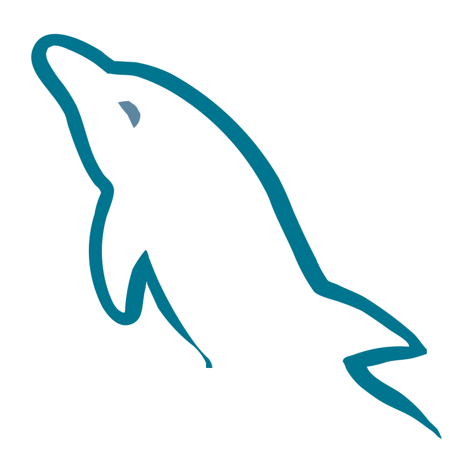

    

<h2 align="center">
    
</h2>

<h5 align="center">
    
</h5>

    Hi, I'm Wolf — Software Developer & System Engineer from Peru
         
    Also known as Nicolas
         
    Turning imagination into interfaces
         
    I enjoy building front-end experiences driven by creativity
         
    Currently learning basics about React
         
    Contact me here: <a href="mailto:fabricio.gutierrez2212@gmail.com">My e-mail</a>

---

<h2 align="center"> My Stack (Currently)</h2>

    <code></code>
    <code></code>
    <code></code>
    <code></code>
    <code></code>
    <code></code>
    <code></code>

___

<h2 align="center">My Github status</h2>
 

    

        
        
    

             
    

        
    

     
    

---

<h2 align="center">Repositories</h2>

  

<h4 align="center">
    <a href="https://github.com/SoundWolf515?tab=repositories" title="Show Repositories">More projects here</a>
</h4>
